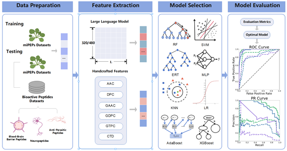

# pLM4PEP

plant miRNA encoded peptides prediction based on protein language model

## Introduction

Movitation:

Plant miPEPs play a crucial role in regulating diverse plant traits. Plant miPEPs identification is challenging due to limitations in the available number of known miPEPs for training. Meanwhile, existing prediction methods rely on manually encoded features to infer plant miPEPs. Recent advances in deep learning modeling of protein sequences provide an opportunity to improve the representation of key features, leveraging large datasets of protein sequences. In this study, we develop a prediction model based on ESM2 to achieve accurate identification of plant miPEPs.

Results:

We propose a prediction model, named pLM4PEP, to predict plant miPEPs. In this field, compared with state-of-the-artl predictor,  pLM4PEP enables more accurate prediction and stronger generalization ability. pLM4PEP utilizes ESM2 to extract peptide feature embeddings, with LR serving as the classifier. The validation experiments conducted on various biopeptide datasets show that pLM4PEP has superior prediction performance.



## Related Files

| FILE NAME               | DESCRIPTION                                                                                   |
|:----------------------- |:--------------------------------------------------------------------------------------------- |
| main.py                 | the main file of pLM4PEP predictor (include data reading, encoding, and classifier selection) |
| predictor.py            | Load pre trained model for prediction                                                         |
| requirements.txt        | Python dependency packages that need to be installed                                          |
| ML_grid_search_model.py | Grid search method for optimizing the structure of neural network                             |
| datasets                | data                                                                                          |
| esm2                    | code for extracting the embedding layer                                                       |
| pydpi                   | protein calculation package                                                                   |
| feature.py              | protein characterization calculation library                                                  |
| model.joblib            | Saved trained pLM4PEP model                                                                   |

## Installation

- Requirement
  
  OS：
  
  - `Windows` ：Windows11
  
	Note: The file environment.yml was exported based on Windows11. So it is recommended to creat the virtual environment on windows system. Some packages will be not found if created by Linux system.

Python：

- `Python` >= 3.8
  
  - Download `pLM4PEP`to your computer
  
  ```bash
  git clone https://github.com/xialab-ahu/pLM4PEP.git
  ```

- open the dir in `conda prompt` and ceate a new environment named `myenv` with `environment.yml`
  
  ```
  cd pLM4PEP
  conda env create -f environment.yml
  conda activate myenv
  ```


## Training and test pLM4PEP model
- Extracting features using [ESM2](https://github.com/facebookresearch/esm)
  
    Note: There are detailed tutorials available on this website(https://github.com/facebookresearch/esm). In our "./pLM4PEP/esm-reduced", we have modified the `extract.py` file and changed the way the model output results are saved from each peptide sequence as a file to the entire dataset as a file. The user should download the esm model which named [esm2_t12_35M_UR50D.pt](https://dl.fbaipublicfiles.com/fair-esm/models/esm2_t12_35M_UR50D.pt) in esm-reduced folder before extracting the embedding layer.
```shell
cd "./pLM4PEP/esm-reduced"
python extract.py esm2_t12_35M_UR50D.pt examples/data/some_proteins_emb_esm2/train_dataset_500.txt train_dataset_500 --include mean
python extract.py esm2_t12_35M_UR50D.pt examples/data/some_proteins_emb_esm2/independent_test_dataset1_607.txt independent_test_dataset1_607 --include mean
python extract.py esm2_t12_35M_UR50D.pt examples/data/some_proteins_emb_esm2/independent_test_dataset2_612.txt independent_test_dataset2_612 --include mean
python extract.py esm2_t12_35M_UR50D.pt examples/data/some_proteins_emb_esm2/independent_test_dataset3_1018.txt independent_test_dataset3_1018 --include mean
```
- Run the `main. py` file to train and evaluate the pLM4PEP model
```shell
cd ..
python main.py
```

## Run pLM4PEP on a new test fasta file
```shell
python predictor.py --file test.fasta --out_path result
```

- `--file` : input the test file with fasta format

- `--out_path`: the output path of the predicted results
### Result
We will package the results of the model's peptide function recognition in a txt file. The format of this file is:
```
name
result
```
The result has two values, namely `positive` and `negative`. `positive` indicates that the sequence you provided is miPEP, otherwise it is not. For example, if you provide a fasta file of a peptide sequence
```
>pri-miRNA159a_f1_s2_train
MEVELLKVQT
```
The result is:
```
>pri-miRNA159a_f1_s2_train
positive
```
## Contact

Please feel free to contact us if you need any help.
# pLM4PEP
# pLM4PEP
